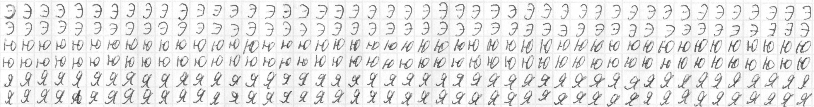
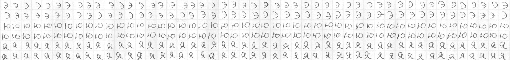
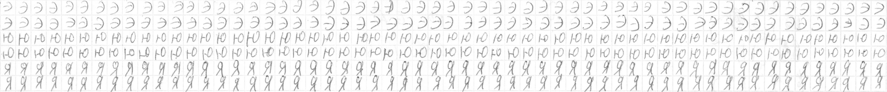
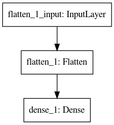
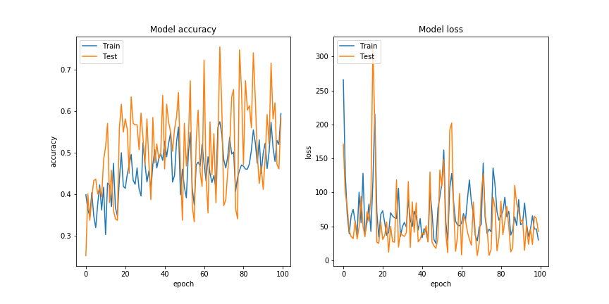
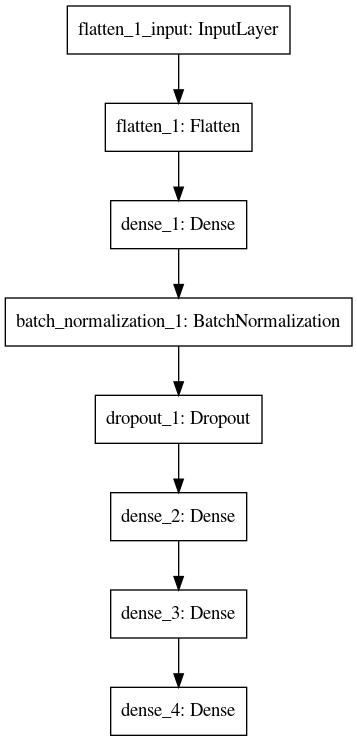
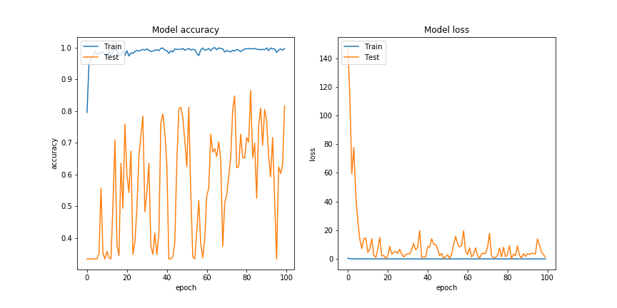
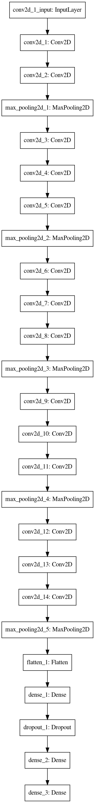
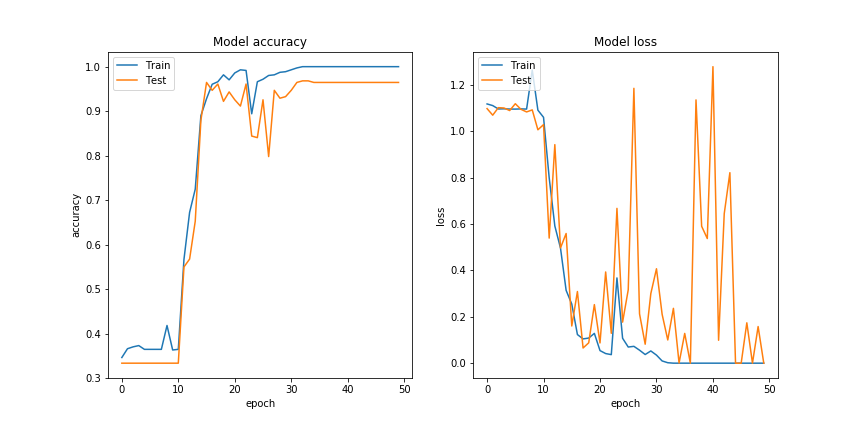

# Отчет по лабораторной работе 
## по курсу "Искусственый интеллект"

## Нейросетям для распознавания изображений


### Студенты: 

| ФИО          | Роль в проекте                                | Оценка       |
|--------------|-----------------------------------------------|--------------|
| Дубинин А.О. | Написание парсера и обработка информации      |              |
| Ваньков Д.А. | Обучение нейросети с одним и несколькими слоями |              |
| Иванов Д.В.  | Обучение сверточной нейросеть                   |              |

## Результат проверки

| Преподаватель     | Дата         |  Оценка       |
|-------------------|--------------|---------------|
| Сошников Д.В. |    27.05.2020          |      5         |

> Было бы хорошо сделать выводы о недо- или пере-обучении на основе графиков accuracy/loss по эпохам

## Тема работы

Построение распознавательной системы набора символов "э", "ю", "я". 

## Распределение работы в команде

Работа была разделена следующим образом: 
* Дубинин А.О. оцифровал датасет, разбил его на составляющие и подготовил тренировочную и тестовую выборки.
* Ваньков Д.А. построил структуру однослойной и двуслойной сетей, реализовал их при помощи ***keras*** и обучил их на тренировочной и тестовой выборках.
* Иванов Д.В. построил структуру сверточной сети, реализовал ее при помощи ***keras***, а также обучил ее на тренировочной и тестовой выборках.  

## Подготовка данных

Фотографии исходных листов с рукописными символами:




Подготовка датасета была не быстрым занятием. Изначально были проблемы с тем, как сфотографировать наши записи, ведь если ты криво сфотографируешь буквы их потом будет сложнее нарезать, а качество изображение должно быть хорошим для распознания. Из-за этого было решено отсканировать листы. 

Далее была совершенна обработка скана, чтобы работа c ***opencv*** была проще. Но все работа свелась к тому, что мы подгоняли пиксили, чтобы каждая буква была ровно в клетке.

```
def __split(self):
        for i, r_pixel in enumerate(self.rows[:-1]):
            for c_pixel in self.cols[:-1]:
                self.number += 1
                self.step += 1
                image = self.image.get_window(r_pixel, r_pixel + self.image.window,
                                              c_pixel, c_pixel + self.image.window)
                self.save_image(image, self.labels[i])
                self.print_loader()
            self.number += 1
            self.step += 1
            image = self.image.get_window(r_pixel, r_pixel + self.image.window,
                                          self.cols[-1], self.image.end_col)
            self.save_image(image, self.labels[i])
            self.print_loader()
        if self.image.end_row - self.rows[-1] > self.image.window // 2:
            for c_pixel in self.cols[:-1]:
                self.number += 1
                self.step += 1
                image = self.image.get_window(self.rows[-1], self.image.end_row,
                                              c_pixel, c_pixel + self.image.window)
                self.save_image(image, self.labels[i])
                self.print_loader()
            self.number += 1
            self.step += 1
            image = self.image.get_window(self.rows[-1], self.image.end_row,
                                          self.cols[-1], self.image.end_col)
            self.save_image(image, self.labels[i])
            self.print_loader()
```


Ссылка на получившийся датасет:  
[train set](/images/training_set)  
[test set](/images/test_set)  


## Загрузка данных

Разбив исходное изображение на составляющие, мы получили набор изображений каждой буквы. Затем, с помощью ***image generator***, мы загружаем тренировочную и тестовую выборки.

## Обучение нейросети

### Полносвязная однослойная сеть

#### Архитектура



#### Результат



Окончательные значения ошибок на тестовой выборке:
* Accuracy = 0.5851
* Loss = 42.4255

### Полносвязная многослойная сеть

#### Архитектура



#### Обоснование

Были выбраны три скрытых полносвязных слоя. Функция активации на скрытых слоях ***relu***, так как многие исследования подтверждают ее использование в моделях. Слой ***dropout*** был выбран для уменьшение коллизий. В ходе обучение модели было получено, что слой ***batch normalization*** улучшает модель.

#### Результат



Окончательные значения ошибок:
* Accuracy = 0.8156
* Loss = 1.2090

### Свёрточная сеть

#### Архитектура



#### Обоснование

Для сверточной нейронной сети была выбрана архитектура, схожая с ***VGG***. В результате в полносвязанную сеть подавался тензор рамером : (1,1,256). Это позволило выделить признаки, отличные от пиксельного сравнения, например, линии.

В качестве полносвязанной сети была выбрана сеть с двумя скрытыми слоями. Это обусловленно тем, что полносвязанной сетью можно аппроксимировать практически любую функцию. Количество нейронов выяснялось экспериментально.

Слой ***Dropuot*** был добавлен для большей независимости обучения параметров. Параметр слоя был выбран 0.5 из соображений массового использования.

Функция активации на скрытых слоях ***ReLu***,так как ее практическое примение показывает хорошие результаты и обеспечивает большую скорость обучения модели.

Обучение происходило на 100 эпохах, количество которых так же было выяснено экспериментально.

#### Результат



Окончательные значния ошибок:
* Loss = 0.1537
* Accruracy = 0.9681


## Выводы

Данная лабораторная работа научила нас:

  1. Оцифровка изображения и его разбиение на составляющие.
  2. Построение и обучение нейронных сетей.
  
Заставила задуматься над тем, что построение нейронных сетей - это опредленный вид искусства, а также каким сложным бывает даже самое простое изображение.

Разработка парсера научила нас тому, что можно не боятся работы с изображениями в python. Так как это происходит очень легко благодаря библиотеке opencv, главное хорошо уметь фотографировать данные.

Разработка нейронных сетей является не самой простой задачей, поэтому нам пришлось уделить время на поиск информации и ее интеграцию.

Хочется заметить, что для повышение эффективности командной работы было принято решение о смене названия команды с ***top-canibus*** на ***kexibit***, а также согласование режимов дня, для улучшения коммуникационных способностей ее членов.  
